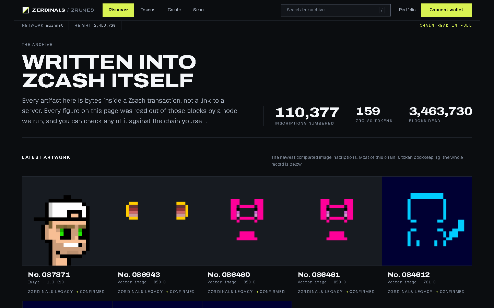

# Zerdinals and ZRunes

**The record of what has been written into Zcash, read from a node its
operators run.** Zerdinals inscriptions, ZRunes, ZRC-20 tokens, and
collections, each shown with the chain evidence behind it.

**[Open the product](https://zrunes.io)** ·
**[Read the documentation site](https://bitcoinuniverseio.github.io/docs-zerdinals-and-zrunes/)** ·
**[Current status](src/content/docs/start/status.mdx)**

[](https://zrunes.io)

*The live product on 2026-08-28: chain read in full, every figure from
first-party infrastructure.*

## Start here

| You are | Start with |
| --- | --- |
| **A collector** | [Safety in sixty seconds](src/content/docs/start/safety.md), then [Portfolio and watchlists](src/content/docs/own/portfolio.md) |
| **A creator** | [Inscribe a Zerdinal](src/content/docs/create/inscribe.md) and [Etch, mint, transfer ZRunes](src/content/docs/create/etch-mint-transfer.md) |
| **A developer** | [Public HTTP API](src/content/docs/developers/api.md) and [the protocol specifications](src/content/docs/protocols/zerdinals-v1.md) |

## What this is

People write things into the Zcash blockchain: images, text, and token
instructions. Once written, those bytes survive as long as Zcash does.
[zrunes.io](https://zrunes.io) is the complete record of that activity, read
block by block from Universe-operated Zcash infrastructure, with no
third-party chain service anywhere. Where the chain has not been read in
full, the product says so; where two token rule sets disagree, it shows both
readings and names each; where an asset moved into the shielded pool, it
says exactly what that means.

## Read this first: how people lose these assets

An inscription or a ZRune balance sits on one transparent output that also
holds a little ZEC. A wallet that does not know about inscriptions can spend
that output as a fee or change, and the asset goes with it, silently and
permanently. [The sixty-second version](src/content/docs/start/safety.md) is
the most important page in this documentation.

## What works today

Reading is fully live over a completely read chain. Creating and
transferring stop at the signing step: no wallet can sign these transactions
yet, and production writes stay disabled until signing is qualified. ZRunes
activate on mainnet at block 3,470,000. The authoritative, dated detail is
on [Current status](src/content/docs/start/status.mdx).

## Documentation map

- **Start here:** [What this is](src/content/docs/start/what-this-is.md) · [Safety](src/content/docs/start/safety.md) · [Status](src/content/docs/start/status.mdx)
- **Understand:** [Zerdinals](src/content/docs/understand/zerdinals.md) · [ZRunes](src/content/docs/understand/zrunes.md) · [ZRC-20](src/content/docs/understand/zrc-20.md) · [Ownership and outputs](src/content/docs/understand/ownership-and-outputs.md) · [Transparent and shielded](src/content/docs/understand/transparent-and-shielded.md) · [Collections](src/content/docs/understand/collections.md)
- **Create:** [Inscribe](src/content/docs/create/inscribe.md) · [Etch, mint, transfer](src/content/docs/create/etch-mint-transfer.md) · [Fees](src/content/docs/create/fees.md) · [Signing availability](src/content/docs/create/signing-availability.md)
- **Own and protect:** [Portfolio and watchlists](src/content/docs/own/portfolio.md) · [Protect outputs](src/content/docs/own/protect.md) · [Recovery](src/content/docs/own/recovery.md)
- **Verify:** [Search](src/content/docs/verify/search.md) · [ZordiScan](src/content/docs/verify/zordiscan.md) · [What an empty result means](src/content/docs/verify/coverage.md)
- **Protocols:** [Zerdinals v1](src/content/docs/protocols/zerdinals-v1.md) · [ZRunes v1](src/content/docs/protocols/zrunes-v1.md) · [Collections v1](src/content/docs/protocols/collections-v1.md) · [Ordinality decision](src/content/docs/protocols/ordinality.md)
- **Developers:** [Architecture](src/content/docs/developers/architecture.md) · [Public HTTP API](src/content/docs/developers/api.md)
- **Help:** [FAQ](src/content/docs/help/faq.md) · [Known limitations](src/content/docs/help/known-limitations.md)

## This repository

One Markdown source builds both views: these files read completely on
GitHub, and the same files build the searchable documentation site with
[Astro Starlight](https://starlight.astro.build/). Content lives in
`src/content/docs/`; the site deploys to GitHub Pages from `main`.

```bash
npm ci
npm run dev
```

`npm test` runs the copy guard, the public-safety scan, the status-data
check, and Markdown lint; `npm run build` also validates every internal
link. [CONTRIBUTING.md](CONTRIBUTING.md) has the full workflow and writing
rules.

## Support, security, contributing

- Questions and problems: [open an issue](https://github.com/bitcoinuniverseio/docs-zerdinals-and-zrunes/issues) with the documentation bug or improvement template.
- Security reports: [SECURITY.md](SECURITY.md). Do not open a public issue for a vulnerability.
- Contributions: [CONTRIBUTING.md](CONTRIBUTING.md) · [Code of conduct](CODE_OF_CONDUCT.md)

## License

Documentation text and images are licensed under
[CC BY 4.0](LICENSE); the protocol specifications remain authoritative in
the product repository, and code samples are provided under the same
license.
